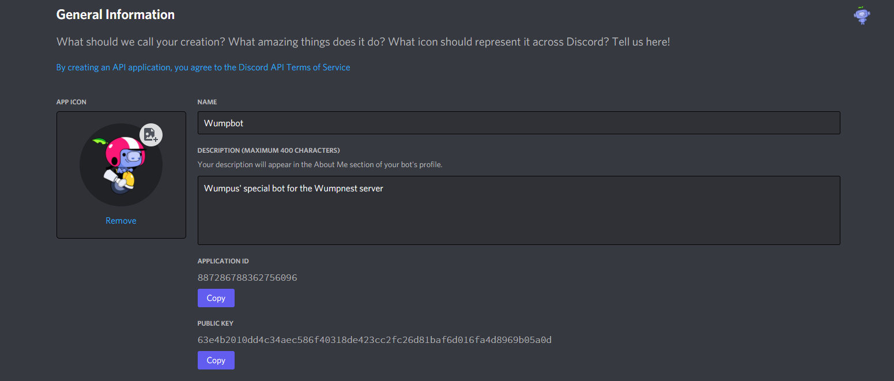
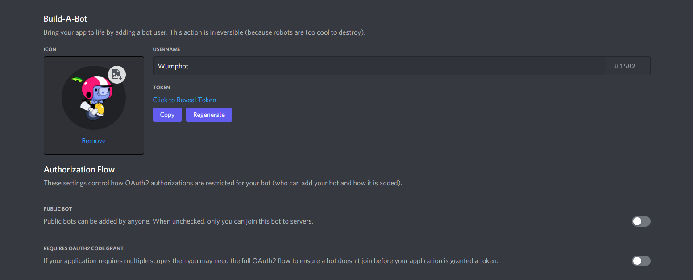

# Authenticating to Discord

The next step is to use the application you created! This page will go through authenticating
to Discord and getting the necessary credentials.

## Interaction Server

Discord provides two ways for bots to use its API and receive events.

The newest one is through an interaction server. This is a normal HTTP server (like a website)
that Discord makes requests to.

It is the recommended way if you are making a bot that only relies on interactions. This
tutorial will focus on using an interaction server because it is the easiest to use with free
services like [Heroku](https://www.heroku.com/) and [Replit](https://replit.com/).

To use an interaction server there is at a minimum two values you need. It is the
**Application ID** and **Public Key** of your application.

They can be found on the first page after visiting the
[Discord Developer Portal](https://discord.com/developers/) and selecting your application:



These can now be passed to `InteractionApp` like this:

```python
from wumpy import interactions

app = interactions.InteractionApp(
    887286788362756096,
    '63e4b2010dd4c34aec586f40318de423cc2fc26d81baf6d016fa4d8969b05a0d'
)
```

### Automatically creating commands

If you want Wumpy to be able to automatically synchronize application commands
with Discord there is a third value necessary.

It is the **Client Secret** and can be found under the OAuth2 tab in the sidebar:


You can now change the code to pass the secret with the `secret` keyword-argument:

```python
from wumpy import interactions

app = interactions.InteractionApp(
    887286788362756096,
    '63e4b2010dd4c34aec586f40318de423cc2fc26d81baf6d016fa4d8969b05a0d',
    secret='AbCd3fgH1jKlmN0pqrst0vwxyzAbCd3f'  # THIS MUST STAY SECRET
)
```

!!! error
    **The client secret must stay secret!** Never ever push the secret to GitHub or hand it
    out to anyone. Read [Hiding credentials](#hiding-credentials) for more information.

## Gateway

This is the second way to use the Discord API, the bot will connect to Discord through a
WebSocket and receive events like a user.

If you are making a bot that needs to react to messages, reactions, typings, changes to
channels, members joining or leaving, presence updates or similar events then you have no
choice but to use the gateway.

You can also receive interactions through the gateway **but not at the same time as you have**
**an interaction server**.

You only need one credential when using the gateway and it is the **Bot Token** you'll find
under the Bot tab in the sidebar:



It can then be passed to `Client` like this:

```python
import wumpy

# THE TOKEN MUST STAY SECRET
bot = wumpy.Client(token='ODg3Mjg2Nzg4MzYyNzU2MDk2.YUB8Nw.AbCD3Fgh1jKLMn0pQRST0VwxYz0')
```

!!! error
    **The bot token must stay secret**, it should never be pushed to GitHub or given to anyone
    else. Read [Hiding Credentials](#hiding-credentials) for more information.

## Hiding credentials

There are some values required when talking to Discord that have to stay hidden.

This is because if someone else gets ahold of it they can talk to Discord as you.

If Wumpus gets ahold of your bot token, it can login as your bot and then do anything.

### Hidden Python files

One easy way of making sure your credentials stay hidden is with a normal Python file.

Create a file called `config.py` (but you can name it whatever you want) and define a variable
with your client secret or bot token:

=== "Client Secret"

    Your file should look like this:

    ```python
    SECRET = 'AbCd3fgH1jKlmN0pqrst0vwxyzAbCd3f'
    ```

    Now go back to your main file and import the variable like this:

    ```python
    from wumpy import interactions

    from config import SECRET

    app = interactions.InteractionApp(
        887286788362756096,
        '63e4b2010dd4c34aec586f40318de423cc2fc26d81baf6d016fa4d8969b05a0d',
        secret=SECRET
    )
    ```

=== "Bot token"

    Your file should look like this:

    ```python
    TOKEN = 'ODg3Mjg2Nzg4MzYyNzU2MDk2.YUB8Nw.AbCD3Fgh1jKLMn0pQRST0VwxYz0'
    ```

    Now go back to your main file and import the variable like this:

    ```python
    import wumpy

    from config import TOKEN

    bot = wumpy.Client(token=TOKEN)
    ```

If you use [Git](https://git-scm.com/) the final step is to add `config.py` to your
`.gitignore` file so that it can't accidentally be included in commits.

### .env files

Another option is to use `.env` files which will be loaded as enviroment variables.

This will require `python-dotenv` to be installed so that it can load the file:

```bash
python -m pip install python-dotenv
```

After `python-dotenv` has been installed create a file called `.env`.

=== "Client Secret"

    It should look like this:

    ```dotenv
    SECRET=AbCd3fgH1jKlmN0pqrst0vwxyzAbCd3f
    ```

    Then import `python-dotenv` and `os` like this:

    ```python
    import os

    from dotenv import load_env
    from wumpy import interactions

    load_env()

    app = interactions.InteractionApp(
        887286788362756096,
        '63e4b2010dd4c34aec586f40318de423cc2fc26d81baf6d016fa4d8969b05a0d',
        secret=os.environ['SECRET']
    )
    ```

=== "Bot token"

    It should look like this:

    ```dotenv
    TOKEN=ODg3Mjg2Nzg4MzYyNzU2MDk2.YUB8Nw.AbCD3Fgh1jKLMn0pQRST0VwxYz0
    ```

    Then import `python-dotenv` and `os` like this:

    ```python
    import os

    import wumpy
    from dotenv import load_env

    load_env()

    bot = wumpy.Client(token=os.environ['TOKEN'])
    ```

### Config files

The last option is to use real configuration files, such as Toml or Yaml.

It is also possible to use JSON for this purpose.

This is mostly used for other purposes than the credentials and can become rather complicated.
For that reason this tutorial won't go into it more than mentioning it.
