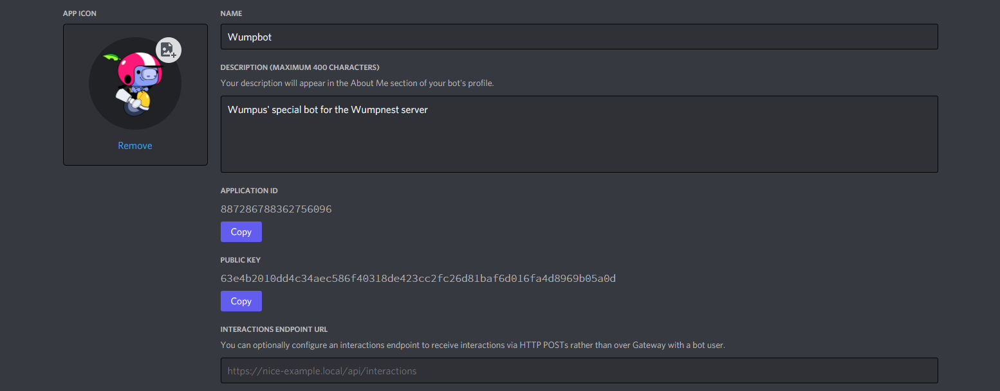

# Running the bot

Discord will not host bots for you, it is your responsibility to be running the bot.
This page will go through tips for running the bot and testing.

## Interaction server

The interaction server is just an HTTP server, like a website!

Wumpy's `InteractionApp` implements the ASGI specification, this means that you can run
your bot with any ASGI server. The following is a non-exhaustive list of ASGI servers:

- [Uvicorn](https://github.com/encode/uvicorn)
- [Hypercorn](https://gitlab.com/pgjones/hypercorn)

Follow the respective guide for the ASGI server you pick.

To use an interaction server, make sure the the server is running then log into the
[Discord Developer Portal](https://discord.com/developers) and configure the interaction
server URL to tell Discord where to send interactions:



### Running it locally

The big drawback with using an interaction server is that Discord requires HTTPS.

This means that you need to port-forward the server and configure certificates.

There are tools for this though, because you are not alone in this inconvenience.

[Ngrok](https://ngrok.com) will open a tunnel to your computer, and allow you to
test the interaction server locally over HTTPS.

!!! info
    Ngrok will not give you the same URL everytime you run it, unless you are using a Pro plan.
    This means that you need to update the interaction URL everytime you restart Ngrok.

## Gateway

The Discord gateway uses WebSockets and requires no further setup.

Start the bot by importing `anyio` and use `anyio.run()` with the backend you want to use:

=== "Asyncio"

    ```python
    import anyio
    import wumpy

    bot = wumpy.Client(...)

    if __name__ == '__main__':
        anyio.run(bot.start, backend='asyncio')
    ```

    !!! note
        `if __name__ == '__main__':` is a way to ensure that code only runs when the bot is
        ran directly, otherwise you might start the bot when attempting to import it.

=== "Trio"

    ```python
    import anyio
    import wumpy

    bot = wumpy.Client(...)

    if __name__ == '__main__':
        anyio.run(bot.start, backend='trio')
    ```

    !!! note
        `if __name__ == '__main__':` is a way to ensure that code only runs when the bot is
        ran directly, otherwise you might start the bot when attempting to import it.

!!! warn
The downside with a long-living WebSocket is that many free hosters like
[Replit](https://replit.com) or [Heroku](https://heroku.com) might kill the bot.
